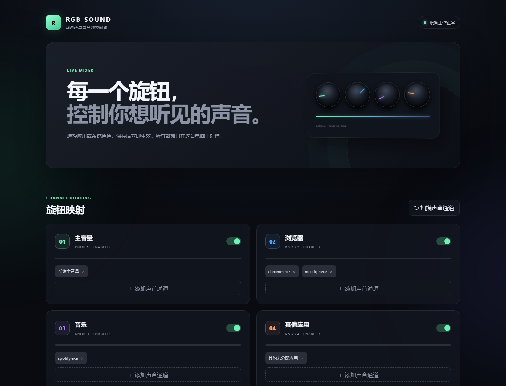

# RGB-SOUND

把 DEEJ-CH552-RGB-Lite 四旋钮音量板变成可视化、可随时自定义的 Windows 音频控制台。

硬件固件持续通过 USB 串口发送 `value1|value2|value3|value4`，RGB-SOUND 在本机读取数据，并使用 Windows Core Audio 控制主音量、麦克风、系统声音或指定应用。双击 EXE 后直接显示独立桌面窗口；内部配置服务只监听 `127.0.0.1`，不会把设备或音频信息暴露到局域网/互联网。



## 桌面软件与界面架构

- 比 Electron 桌面软件轻很多，后台为一个小型 Python 服务。
- 比手改 YAML/JSON 直观，可以扫描正在发声的应用并点击绑定。
- 用户看到的是独立桌面软件窗口，不需要手动打开浏览器。
- 界面仍由本机程序渲染，关闭软件窗口后音量控制一并退出。
- UI 与音频控制分离，后续增加灯效、场景预设或设备状态更容易。

## 功能

- 4 个旋钮分别命名、启用/禁用和实时查看位置。
- 一个旋钮可绑定多个应用，例如 Chrome + Edge。
- 支持系统主音量、默认麦克风、Windows 系统声音、当前前台应用和其他未分配应用。
- 自动发现串口，也可手动选择 COM 口与波特率。
- 支持原始值范围校准、方向反转和信号变化阈值。
- 可选择高、标准或抗抖三档旋钮灵敏度；高灵敏度响应约 0.25% 的硬件步进。
- 配置保存后立即生效，无需重新启动。
- 每 2 秒自动同步一次静止旋钮，新启动的应用无需额外晃动旋钮即可采用当前位置。
- 可选 Windows 开机自动运行。
- 可打包成独立 Windows 程序。
- 配套 CH552 固件：逆时针增大、RGB 从左向右增大，按钮一键静音/解除静音。

## 立即使用

要求：Windows 10/11、Python 3.10 或更高版本，以及已经刷好固件的音量板。

### 方式一：直接运行打包版

双击项目根目录中的 `RGB-SOUND.exe`。这是独立的单文件版本，不要求另外安装 Python。

### 方式二：从源码运行

1. 插入音量板。
2. 按照下方“开发”章节安装依赖，然后运行 `app.py`。
3. RGB-SOUND 桌面窗口会自动显示。
4. 点击“扫描声音通道”，为每个旋钮添加需要控制的应用。
5. 点击“保存并应用”。

应用只有在 Windows 创建了音频会话后才会出现在扫描结果里。找不到应用时，先让它播放一次声音，再重新扫描。

### 建议的首次配置

1. 旋钮 1 绑定“系统主音量”。
2. 旋钮 2 绑定浏览器，例如 `chrome.exe`、`msedge.exe`。
3. 旋钮 3 绑定音乐或语音应用，例如 Spotify、网易云音乐或 Discord。
4. 旋钮 4 绑定“其他未分配应用”，作为兜底通道。

关闭 RGB-SOUND 窗口后软件会缩到系统托盘，旋钮仍会继续工作。双击托盘图标可重新打开控制台；需要完全停止时，右键托盘图标并选择“完全退出”。

## 按钮与 RGB 灯效

要使用正确的按钮动作与 RGB 方向，请将 [`firmware/RGB-SOUND-CH552.hex`](firmware/RGB-SOUND-CH552.hex) 刷入音量板，详细步骤见 [`firmware/README.md`](firmware/README.md)。

最终方向定义固定为：旋钮完全顺时针是 0%，完全逆时针是 100%，逆时针旋转时音量增大；RGB 进度从左往右增加。固件内部使用 0–1023 高分辨率数据传输，软件线性换算为 0–100%，并且不保留旧固件的反向换算。

按钮在按下时立即切换 Windows 系统主音量的静音/解除静音，并使用 20ms 硬件消抖，不再控制灯效。

灯效统一在 RGB-SOUND 软件的“灯效自定义”区域设置，可选择关闭、全灯常亮、呼吸灯或全灯同步变色，并可调整颜色、亮度、速度以及是否在旋转时显示音量进度。已经彻底移除各灯珠快速异步变化的幻彩/频闪效果。调整时会即时预览且不会断开串口，保存后永久保留，重新连接时也会自动恢复。

## 旋钮校准

该硬件常见固件会将 CH552 的 8 位 ADC 值映射到 `0–1023` 后发送，因此默认原始范围是 0 和 1023。

如果旋钮无法到达 0% 或 100%：

1. 在页面顶部观察旋钮实时位置，或访问 `/api/status` 查看原始 `values`。
2. 将全部旋钮转到最小，记下稳定值并填入“原始最小值”。
3. 将全部旋钮转到最大，记下稳定值并填入“原始最大值”。
4. 默认方向固定为逆时针增大。如果使用接线方向不同的其他硬件，才开启“反转旋钮方向”。

如果感觉调节有台阶或延迟，请在“设备与校准”中将“旋钮灵敏度”设为“高（推荐）”；如果电位器老化导致音量自行跳动，再改为“标准”或“抗抖”。

## 特殊通道

| 通道 | 行为 |
|---|---|
| 系统主音量 | 默认扬声器/耳机的总音量 |
| 默认麦克风 | 默认录音设备的输入音量 |
| Windows 系统声音 | Windows 提示音会话 |
| 当前前台应用 | 当前获得焦点的应用；适合游戏切换场景 |
| 其他未分配应用 | 控制所有没有显式分配给其他旋钮的音频应用 |

“其他未分配应用”不会重复控制已经绑定到任一旋钮的进程。

## 构建 EXE

在 PowerShell 中运行：

```powershell
./scripts/build.ps1
```

产物位于项目根目录的 `RGB-SOUND.exe`，可以单独复制和分发。

打包版带有 RGB-SOUND 图标、产品名和文件版本信息，并会排除测试模块及非 Windows 图形后端以缩短启动解压时间。无控制台模式下如果发生启动错误，会显示明确的 Windows 提示框，详细信息写入 `%LOCALAPPDATA%/RGB-SOUND/rgb-sound.log`。

## 开发

```powershell
python -m venv .venv
./.venv/Scripts/python.exe -m pip install -r requirements-dev.txt
./.venv/Scripts/python.exe -m pytest -q
./.venv/Scripts/python.exe app.py
```

配置保存在 `%APPDATA%/RGB-SOUND/config.json`。设置环境变量 `RGB_SOUND_CONFIG` 可以指定其他位置，适合测试或便携使用。

## 故障排查

- 显示“未找到串口设备”：检查 USB 数据线是否支持数据传输，并在设备管理器查看 COM 口。
- 显示“串口已连接，等待旋钮数据”：可能选到了其他串口；手动选择音量板的 COM 口，并确认波特率为 9600。
- 应用不在列表：先播放声音再点“扫描声音通道”。Windows 只为活跃/近期活跃的应用建立音频会话。
- 提示“端口 17321 已被其他程序占用”：关闭占用该端口的程序后再启动；RGB-SOUND 会验证端口上的服务身份，不会误打开其他程序的页面。
- EXE 无法启动：查看 `%LOCALAPPDATA%/RGB-SOUND/rgb-sound.log`，其中会保留无控制台模式下的异常详情。
- 旋钮动作但音量不对：按“旋钮校准”设置原始最小值和最大值。
- 端口被占用：关闭 Arduino 串口监视器、其他 DEEJ 客户端或串口调试工具。

## 项目来源

本项目适配的硬件及原始固件来自立创开源硬件平台的 [DEEJ-CH552-RGB-Lite](https://oshwhub.com/c6c6c6c6c6/deej-ch552-4rv-c6-v1-1)，其思路基于 [omriharel/deej](https://github.com/omriharel/deej)。`firmware` 目录包含针对 RGB-SOUND 修改的固件源码与可刷入文件。

## 许可

[MIT License](LICENSE)
